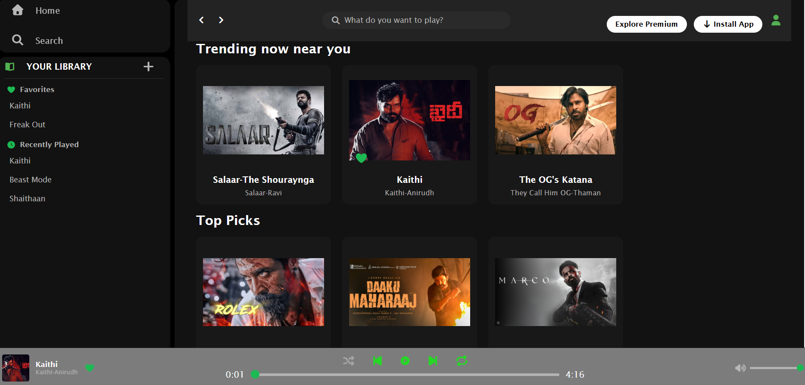

# 🎵 VibeBox — Spotify-Inspired Music Player

VibeBox is a **Spotify-inspired single-page music player** built using **HTML, CSS, and JavaScript**.

It includes real audio playback and interactive features such as shuffle, repeat, favorites, recently played, search, and volume control.

---

## ✨ Features

* 🎧 Play / Pause music
* ⏭️ Next / Previous song
* 📊 Dynamic progress bar with current time and duration
* 🔀 Shuffle mode with randomized playback queue
* 🔁 Repeat All, Repeat One, and Repeat Off
* 🔊 Volume control and Mute / Unmute
* 🔎 Search songs by title or singer
* ❤️ Add / Remove Favorites
* 📚 Your Library with Favorites and Recently Played
* 🕐 Stores the latest 3 unique recently played songs
* 💾 Favorites and Recently Played persist using `localStorage`
* 🎯 Highlights the currently playing song
* 🎵 Dynamically updates song artwork, title, singer, and favorite status
* ▶️ Automatically plays the next song when a song ends
* 🎨 Spotify-inspired responsive user interface

---

## 🖥️ Screenshot



---

## 🛠️ Technologies Used

* HTML5
* CSS3
* JavaScript

---

## ⚙️ How It Works

JavaScript manages the music player state and connects the song cards with the audio files.

* Songs are stored in a JavaScript array and controlled using the HTML5 Audio API.
* Play/Pause, Next, Previous, Shuffle, and Repeat control playback.
* The progress bar and timestamps update according to the current audio time.
* Volume and mute controls manage the audio volume.
* Search dynamically filters songs based on title and singer.
* Favorites are added or removed and stored in `localStorage`.
* Recently Played keeps the latest 3 unique songs and stores them in `localStorage`.
* The player UI dynamically updates according to the currently selected song.
* When a song finishes, the player automatically handles the next song according to the selected playback mode.

---

## 📁 Project Structure

```text
VibeBox/
│
├── index.html
├── style.css
├── script.js
│
├── assets/
│   ├── Song1.mp3
│   ├── Song2.mp3
│   ├── Song3.mp3
│   ├── Song4.mp3
│   ├── Song5.mp3
│   ├── Song6.mp3
│   ├── Song7.mp3
│   └── Song8.mp3
│
├── VibeBox.png
└── README.md
```

> **Note:** The song artwork/images used in the application are loaded through external Google image links and are therefore not included in the project repository.

---

## 💻 Installation & Setup

Clone the repository and Open `index.html` in your browser.

###  Make sure the assets are available

Ensure the `assets` folder contains the required audio files referenced by the project.

---

## ⚠️ Copyright & Audio Disclaimer

VibeBox is created for **educational and demonstration purposes only**.

The song titles, singer/artist information, movie references, and associated artwork displayed in the application belong to their respective copyright and trademark owners and are used only for demonstration purposes.

The artwork is loaded through external image links and is not claimed as original content by this project.

The actual audio files used for playback are sourced from **Pixabay** and are not the original movie songs.

VibeBox is not affiliated with or endorsed by Spotify, the referenced artists, movies, or their respective rights holders.

No copyrighted movie audio is intentionally included in this project.

---

## ⭐ Acknowledgements

* **Pixabay** — Used as the source for the audio files used in the project.

---

## 👨‍💻 Author

**Saiteja**

---